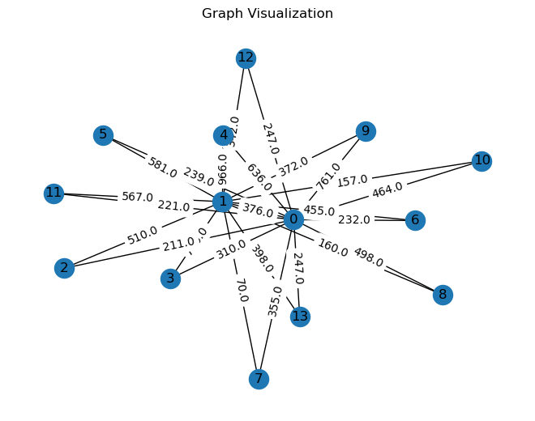

# Evolutionary Algorithm for TSP Optimization

This project implements an **Evolutionary Algorithm (EA)** to solve the **Traveling Salesman Problem (TSP)** using various evolutionary strategies like crossover, mutation, and selection. The algorithm is capable of exploring different combinations of population size, tournament size, and mutation rates to optimize the route for the TSP. 

## Key Features

- **Graph Visualization**: Visualizes the graph representing cities and distances using `networkx`.
- **Evolutionary Algorithm**: Implements improved initialization, selection, crossover, and mutation strategies for optimizing the TSP.
- **Parameter Tuning**: Allows the tuning of key parameters like population size, tournament size, and mutation rates to achieve the best solution.
- **Convergence Curve**: Tracks the performance of the algorithm over time and plots the convergence curve for each combination of parameters.

## Graph Visualizations




## How It Works

1. **Graph Parsing**: The algorithm reads the city and distance information from XML files (e.g., `burma14.xml`, `brazil58.xml`) and creates a graph.
2. **Evolutionary Algorithm**:
   - **Initialization**: Random initialization of population routes.
   - **Selection**: Tournament selection to choose the best routes.
   - **Crossover**: Order crossover to combine parent routes.
   - **Mutation**: Swap mutation to introduce variety into the population.
3. **Fitness Evaluation**: Each route is evaluated based on the total travel cost.
4. **Convergence Tracking**: The algorithm tracks and plots the convergence of fitness values over iterations.

## Installation

1. **Clone the repository**:
   ```bash
   git clone https://github.com/nikhil97353/TSP-Evolutionary-Algorithm.git
   cd TSP-Evolutionary-Algorithm

2. Install the necessary dependencies:
   ```bash
   pip install -r requirements.txt

3. How to Run
  
   ```bash
   python evolutionary_algorithm_tsp.py

Parameter Tuning: Modify parameters such as population_size, tournament_size, and mutation_rate in the script to experiment with different configurations and visualize the performance.

4. Experimenting with Parameters
To identify the combination of parameters that produces the best results, you can:
Define parameter combinations for population size, tournament size, crossover, and mutation.
Run the algorithm for each combination and record the best solution found.
Plot the convergence curve and analyze performance across iterations.

Results
Best Route: The algorithm outputs the best route for the TSP after each run.
Best Fitness: Displays the total travel cost for the best solution.
Convergence Curve: The plot shows the progression of the best fitness over the iterations.

5. Example of Convergence Curve
   ```bas
   plt.plot(fitness_over_time)
   plt.title('Convergence Curve')
   plt.xlabel('Iteration')
   plt.ylabel('Best Fitness (Total Travel Cost)')
   plt.show()

6. License

This project is licensed under the MIT License.


